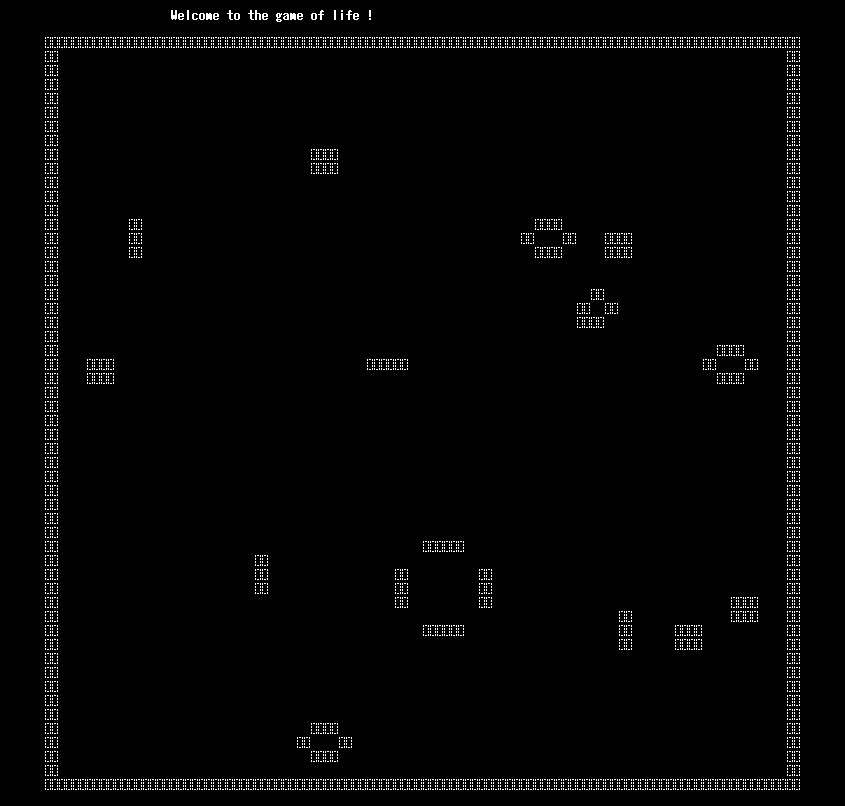

# rust-plinth

Learning Rust step by step while going over the CS fundamentals.

## Content

#### Generative

- :heavy_check_mark: [Game of Life](./generative/game_of_life/)

- :heavy_check_mark: [Perlin noise](./generative/perlin_noise/)

#### Game 

- :heavy_check_mark: [Guess](./game/guess/)

#### Algorithm

- :construction: [Bubble sort](./algorithm/bubble_sort/) 

- :heavy_check_mark: [Quick sort](./algorithm/quicksort/)

- :heavy_check_mark:[Optimal matrix chain](./algorithm/optimal_matrix_chain/)

#### Data Structure

- :heavy_check_mark: [Heap](./data_structure/heap/) 

- :construction: [Stack](./data_structure/stack/) 

## Screenshots

  

