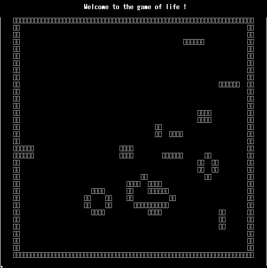

# rust-plinth

Learning Rust step by step while going over the CS fundamentals

## Content

#### Game

- [Game of Life](./game/game_of_life/) :ballot_box_with_check:

- [Guess](./game/guess/) :ballot_box_with_check:

#### Algorithm

- [Bubble sort](./algorithm/bubble_sort/) :construction:

- [Quick sort](./algorithm/quick_sort/) :ballot_box_with_check:

- [Optimal matrix chain](./algorithm/optimal_matrix_chain/) :ballot_box_with_check:

#### Data Structure

- [Heap](./data_structure/heap/) :construction:

- [Stack](./data_structure/stack/) :construction:

## Screenshot

  

